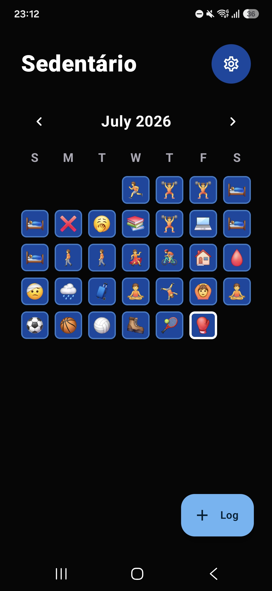
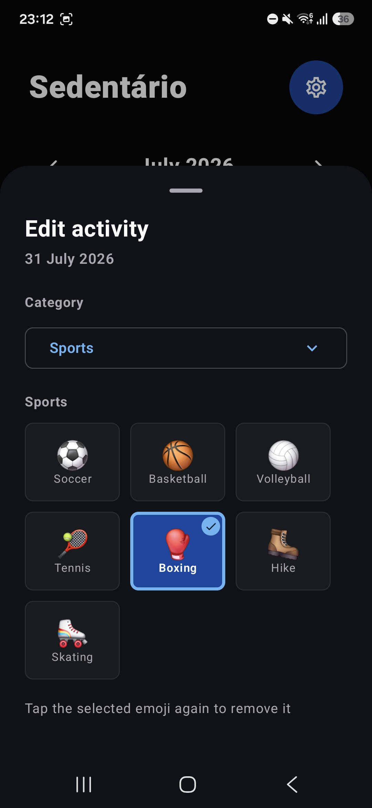
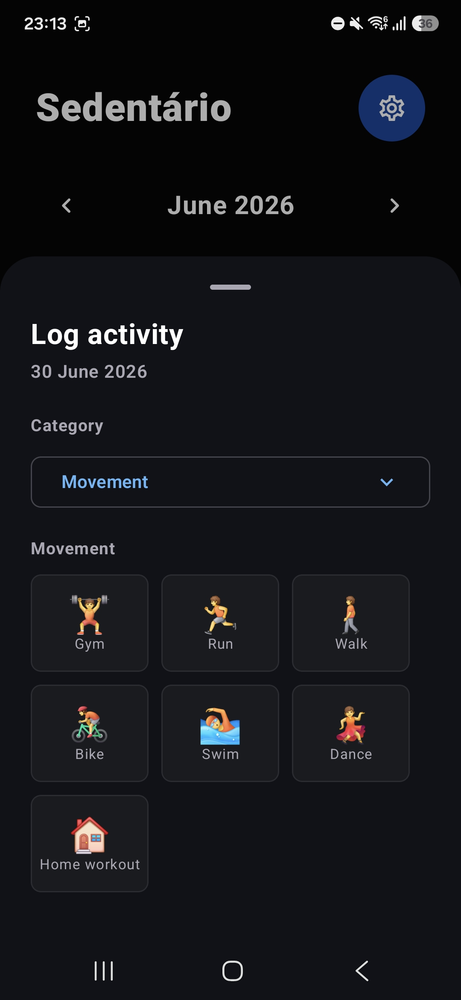
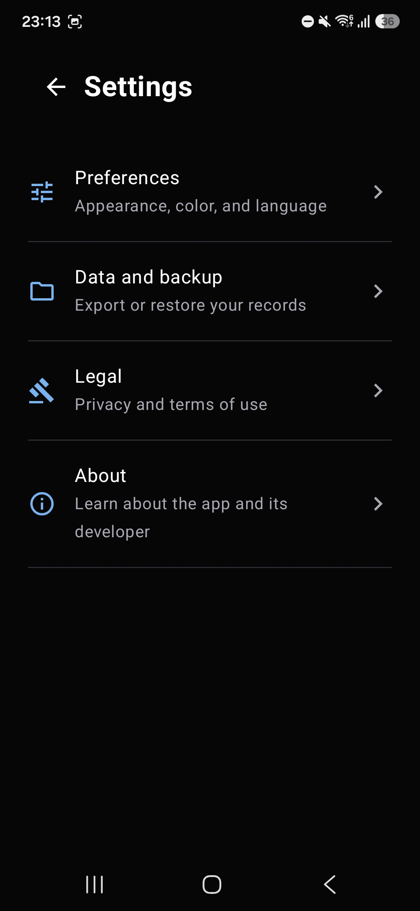

# Sedentário

Um registro simples de atividades para acompanhar sua rotina e visualizar sua evolução ao longo do tempo.

O Sedentário permite marcar cada dia com um emoji em poucos segundos. A ideia é tornar o acompanhamento de hábitos leve o bastante para fazer parte da rotina, sem exigir o preenchimento de exercícios, séries ou outras informações detalhadas.

[Baixar a versão mais recente](https://github.com/dhianapereira/sedentario/releases/latest)

## O app por dentro

<p align="center">
  
  
  
  
</p>

## Funcionalidades

- Registro de atividades por emojis em um calendário mensal.
- Categorias para movimento, esportes, bem-estar, ciclo menstrual, descanso e motivos.
- Edição e remoção de registros.
- Temas claro, escuro ou definido pelo sistema.
- Personalização da cor principal do app.
- Interface em português e inglês.
- Exportação dos registros para um arquivo JSON.
- Importação de backups por mesclagem ou restauração completa.

## Privacidade

Os registros e as preferências ficam armazenados localmente no dispositivo. O Sedentário não possui acesso à internet, não exibe anúncios e não utiliza serviços de análise ou rastreamento.

## Tecnologias

- Kotlin e Jetpack Compose.
- Material 3.
- Room para persistência dos registros.
- DataStore para preferências.
- Hilt para injeção de dependência.
- Navigation Compose.
- Coroutines e Flow.
- Arquitetura MVVM organizada por funcionalidade.

## Como executar

### Pré-requisitos

- Android Studio com JDK 17.
- Android SDK 35 instalado.
- Emulador ou dispositivo com Android API 26 ou superior.

### Android Studio

1. Abra a raiz do projeto no Android Studio.
2. Aguarde a sincronização do Gradle.
3. Selecione o módulo `app` e um dispositivo ou emulador.
4. Clique em **Run**.

O Android Studio cria o `local.properties` automaticamente com o caminho do SDK local.

### Terminal

Use o Gradle Wrapper incluído no projeto:

```bash
# Gerar o APK de debug
./gradlew assembleDebug

# Instalar em um dispositivo conectado
./gradlew installDebug

# Executar os testes unitários
./gradlew testDebugUnitTest

# Executar o Android Lint
./gradlew lintDebug
```

No Windows, substitua `./gradlew` por `gradlew.bat`.

## Estrutura do projeto

O projeto utiliza MVVM e organiza a interface por funcionalidade:

- `model/`: modelos e tipos de negócio.
- `data/activity/`: persistência e acesso aos registros de atividades.
- `data/backup/`: importação e exportação dos backups em JSON.
- `data/database/`: configuração do banco de dados Room.
- `data/preferences/`: preferências persistidas com DataStore.
- `di/`: módulos de injeção de dependência com Hilt.
- `ui/components/`: componentes gerais compartilhados pelo app.
- `ui/navigation/`: fluxo de navegação entre as telas.
- `ui/settings/`: configurações, aparência e gerenciamento de backups.
- `ui/tracker/`: calendário, registro de atividades, estado e `ViewModel`.
- `ui/theme/`: cores e tema do Jetpack Compose.

## Releases

As releases são publicadas automaticamente a partir de tags Semantic Versioning e incluem APK, Android App Bundle e checksums SHA-256.

- [Baixar a versão mais recente](https://github.com/dhianapereira/sedentario/releases/latest)
- [Documentação do processo de release](./docs/RELEASE.md)

## Licença

O código-fonte está licenciado sob a [Licença MIT](./LICENSE).

O logotipo, os ícones, as capturas de tela e os elementos de identidade visual não estão cobertos pela Licença MIT e permanecem sob a condição de Todos os direitos reservados.
